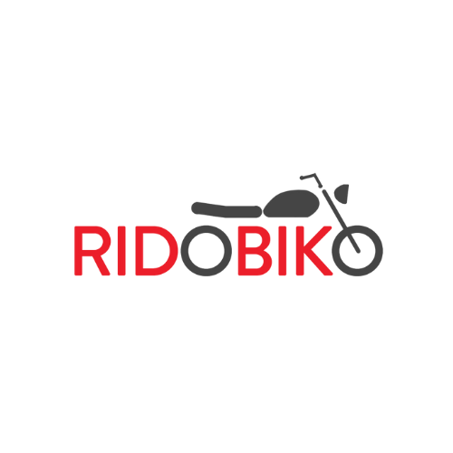

<a name="readme-top"></a>


[![Contributors][contributors-shield]][contributors-url]
[![Forks][forks-shield]][forks-url]
[![Stargazers][stars-shield]][stars-url]
[![Issues][issues-shield]][issues-url]
<!-- [![MIT License][license-shield]][license-url] -->
[![LinkedIn][linkedin-shield]][linkedin-url]


<br />
<div align="center">
  <a href="https://github.com/Ridobiko-BikeRental/RidobikoCustomer/">
    
  </a>

  <h3 align="center">Ridobiko Customer</h3>

  <p align="center">
    Scooter/Bike Rental
    <br />
    <a href="https://github.com/Ridobiko-BikeRental/RidobikoCustomer/releases"><strong>Download from <strong>Play Store</strong> »</strong></a>
    <br />
    <br />
    <a href="https://github.com/Ridobiko-BikeRental/RidobikoCustomer">View Demo</a>
    ·
    <a href="https://github.com/Ridobiko-BikeRental/RidobikoCustomer/issues">Report Bug</a>
    ·
    <a href="https://github.com/Ridobiko-BikeRental/RidobikoCustomer/issues">Request Feature</a>
  </p>
</div>


<!-- TABLE OF CONTENTS -->
<details>
  <summary>Table of Contents</summary>
  <ol>
    <li>
      <a href="#about-the-project">About The Project</a>
      <ul>
        <li><a href="#built-with">Built With</a></li>
      </ul>
    </li>
    <li>
      <a href="#getting-started">Getting Started</a>
      <ul>
        <li><a href="#prerequisites">Prerequisites</a></li>
        <li><a href="#installation">Installation</a></li>
      </ul>
    </li>
    <li><a href="#usage">Usage</a></li>
    <li><a href="#roadmap">Roadmap</a></li>
    <li><a href="#contributing">Contributing</a></li>
    <!-- <li><a href="#license">License</a></li> -->
    <li><a href="#contact">Contact</a></li>
    <li><a href="#acknowledgments">Acknowledgments</a></li>
  </ol>
</details>


<!-- ABOUT THE PROJECT -->
## About The Project
<br>
<p align='center'>
&nbsp;&nbsp;&nbsp;&nbsp;
</p>
<br>

Online self drive motorcycle/scooter rental platform operating in 30+ cities.


Booking a bike through RidoBiko is the easiest thing you would have ever done. Just signup to be part of our community of bike riding enthusiasts, select the bike you want and woof your ride is ready to mount. RidoBiko ensures transparency in every step and provides the highest level of service achievable. Join our community, enjoy the thrill of riding through the hills of India or enjoy the serenity of long drives with your partner.

Rides starting as low as ₹200/day! Forget owning, now get your Ridobiko Bike.
No more waiting for cabs, or getting squished in public transport or shuttles, solve urban mobility by just installing & booking from our Ridobiko app and move on your own terms.
We made it easy for our customers to book bikes/scooter in Just 3 steps:-

Step 1 - Select city and trip dates   
Step 2 - Select Bikes/Scooters   
Step 3 - Checkout  


<p align="right">(<a href="#readme-top">back to top</a>)</p>


### Built With

This section should list any major frameworks/libraries used to this project:
- Flutter

<p align="right">(<a href="#readme-top">back to top</a>)</p>


<!-- GETTING STARTED -->
## Getting Started

This is how you may setting up your project locally.
To get a local copy up and running follow these simple steps.

### Prerequisites

This is an example of how to list things you need to use the software and how to install them.
* Flutter SDK
* Android Studio

### Installation

1. Install Flutter SDK at your system.
2. Clone the repo  

   ```sh
   git clone https://github.com/Ridobiko-BikeRental/RidobikoCustomer.git
   ```
3. Install flutter packages
   ```sh
   flutter pub get
   ```
4. Run application locally in debug mode
   ```sh
   flutter run --debug
   ```

<p align="right">(<a href="#readme-top">back to top</a>)</p>


<!-- USAGE EXAMPLES -->
## Usage

Use this space to show useful examples of how a project can be used. Additional screenshots, code examples and demos work well in this space. You may also link to more resources.

_For more information, please refer to the [Official Website](https://www.ridobiko.com/)_

<p align="right">(<a href="#readme-top">back to top</a>)</p>


<!-- ROADMAP -->
## Roadmap

- [X] Paytm SDK integrated
- [X] Offers and Coupon Section
- [X] Vehicle Document explorer for ongoing booking
- [ ] Home Delivery
- [ ] User refund payment save option

See the [open issues](https://github.com/Ridobiko-BikeRental/RidobikoCustomer/issues) for a full list of proposed features (and known issues).

<p align="right">(<a href="#readme-top">back to top</a>)</p>


<!-- CONTRIBUTING -->
## Contributing

Contributions are what make the open source community such an amazing place to learn, inspire, and create. Any contributions you make are **greatly appreciated**.

If you have a suggestion that would make this better, please fork the repo and create a pull request. You can also simply open an issue with the tag "enhancement".
Don't forget to give the project a star! Thanks again!

1. Fork the Project
2. Create your Feature Branch (`git checkout -b feature/FeatureName`)
3. Commit your Changes (`git commit -m 'Added FeatureName'`)
4. Push to the Branch (`git push origin feature/FeatureName`)
5. Open a Pull Request

<p align="right">(<a href="#readme-top">back to top</a>)</p>

<!-- LICENSE -->


<!-- CONTACT -->
## Contact

Subroto Kumar - [@subrotokr](https://twitter.com/subrotokr) - subrotokumar@outlook.in

Project Link: [https://github.com/Ridobiko-BikeRental/RidobikoCustomer](https://github.com/Ridobiko-BikeRental/RidobikoCustomer)

<p align="right">(<a href="#readme-top">back to top</a>)</p>


<!-- ACKNOWLEDGMENTS -->
## Acknowledgments

* Alchemy
* Flaticon
* Icon8
* LottieFiles.com

<p align="right">(<a href="#readme-top">back to top</a>)</p>


<!-- MARKDOWN LINKS & IMAGES -->
<!-- https://www.markdownguide.org/basic-syntax/#reference-style-links -->
[contributors-shield]: https://img.shields.io/github/contributors/Ridobiko-BikeRental/RidobikoCustomer.svg?style=for-the-badge
[contributors-url]: https://github.com/Ridobiko-BikeRental/RidobikoCustomer/graphs/contributors
[forks-shield]: https://img.shields.io/github/forks/Ridobiko-BikeRental/RidobikoCustomer.svg?style=for-the-badge
[forks-url]: https://github.com/Ridobiko-BikeRental/RidobikoCustomer/network/members
[stars-shield]: https://img.shields.io/github/stars/Ridobiko-BikeRental/RidobikoCustomer.svg?style=for-the-badge
[stars-url]: https://github.com/Ridobiko-BikeRental/RidobikoCustomer/stargazers
[issues-shield]: https://img.shields.io/github/issues/Ridobiko-BikeRental/RidobikoCustomer.svg?style=for-the-badge
[issues-url]: https://github.com/Ridobiko-BikeRental/RidobikoCustomer/issues
[license-shield]: https://img.shields.io/github/license/Ridobiko-BikeRental/RidobikoCustomer.svg?style=for-the-badge
[license-url]: https://www.linkedin.com/in/kumarsubroto
[linkedin-shield]: https://img.shields.io/badge/-LinkedIn-black.svg?style=for-the-badge&logo=linkedin&colorB=555
[linkedin-url]: https://www.linkedin.com/company/ridobiko/
[product-screenshot]: ./assets/images/banner.png